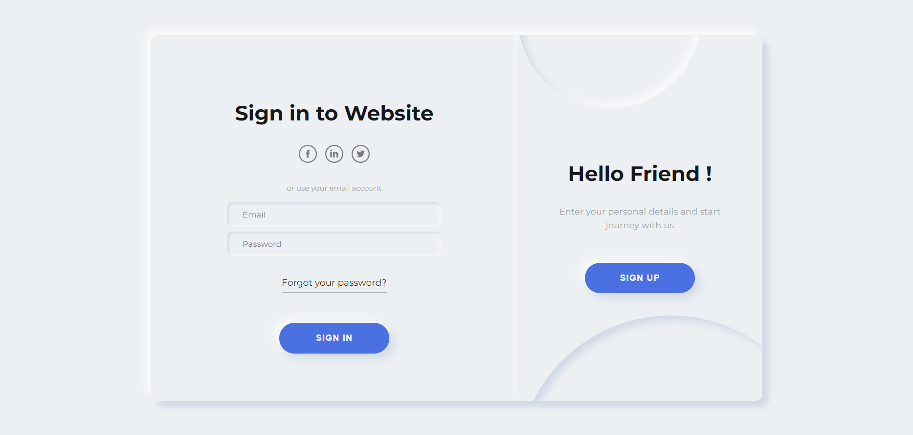

# Pagina-de-login

> Desafio de criar uma Pagina de login simples e moderna

### Ajustes e melhorias

O projeto ainda está em desenvolvimento e as próximas atualizações serão voltadas nas seguintes tarefas:

- [x] Tarefa 1      Executar o Desafio e concluir uma pagina funcional com animação para login e cadastro

### Conhecimento usado no desafio

-HTML usado para semanticamente para melhor acessibilidade
 
-CSS exercitado com flexbox, reset basico de css para melhor aproveitamento do CSS, uso de keyframes e outros comandos css para personalizacão da pagina
 
-JS para uso de algumas animacões

## 📫 Quer executar o Desafio e aprender?
Aqui estão os links para executar o projeto

<a href="https://www.youtube.com/watch?v=A8OBtZR9Msw">Video ensinando a fazer<a/>
 
<a href="https://www.futurecodersweb.com/2021/05/neumorphism-login-and-sign-up-form.html">Post no blog sobre o desafio<a/>
 
<a href="https://fordunn.github.io/Pagina-de-login/">Link do site hospedado<a/>
